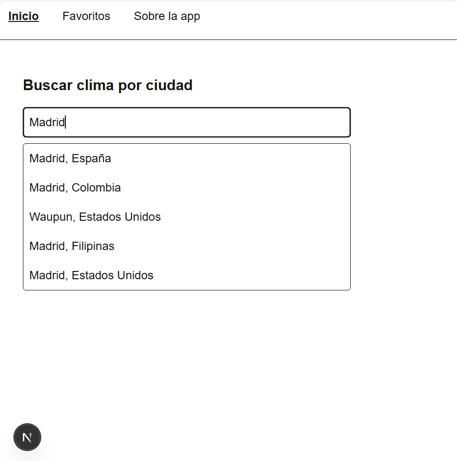
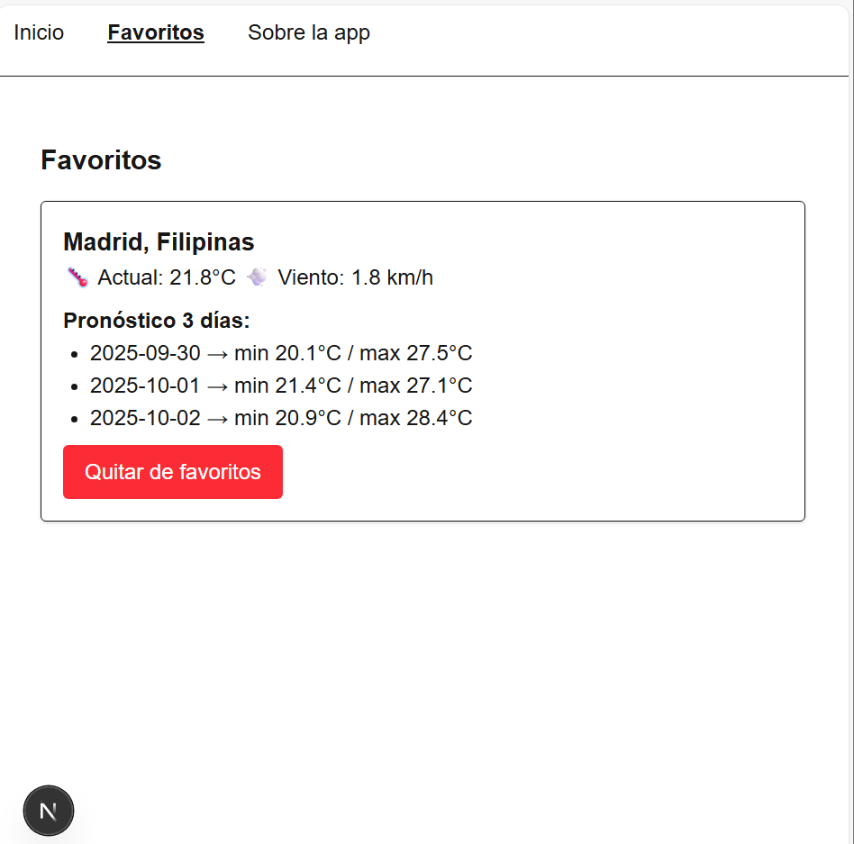
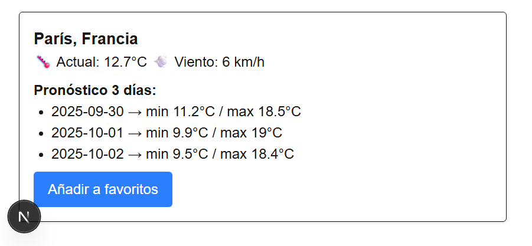

Mini-App del Clima

Aplicación del clima desarrollada con **Next.js + Tailwind + Open-Meteo API**.

Instalación y ejecución

Clonar el repositorio:
   ```bash
   git clone https://github.com/tuusuario/weather-mini.git
   cd weather-mini

# Capturas de pantalla







##Documentación de la API

##Endpoint
https://geocoding-api.open-meteo.com/v1/search?name={ciudad}

##Ejemplo de request
https://geocoding-api.open-meteo.com/v1/search?name=Madrid

##Ejemplo de response
{
  "results": [
    {
      "id": 3117735,
      "name": "Madrid",
      "latitude": 40.4167,
      "longitude": -3.7038,
      "country": "España",
      "population": 3266126
    }
  ]
}

##Endpoint:

https://api.open-meteo.com/v1/forecast?latitude={lat}&longitude={lon}&current_weather=true&daily=temperature_2m_max,temperature_2m_min


##Ejemplo de request:

https://api.open-meteo.com/v1/forecast?latitude=40.4167&longitude=-3.7038&current_weather=true&daily=temperature_2m_max,temperature_2m_min


##Ejemplo de response:

{
  "latitude": 40.4167,
  "longitude": -3.7038,
  "current_weather": {
    "temperature": 22.5,
    "windspeed": 12.3
  },
  "daily": {
    "time": ["2025-09-29", "2025-09-30", "2025-10-01"],
    "temperature_2m_max": [26.1, 25.3, 24.8],
    "temperature_2m_min": [15.2, 14.9, 14.3]
  }
}

vercel enlace: https://weather-m4n2lty3m-claras-projects-f6cccead.vercel.app/
